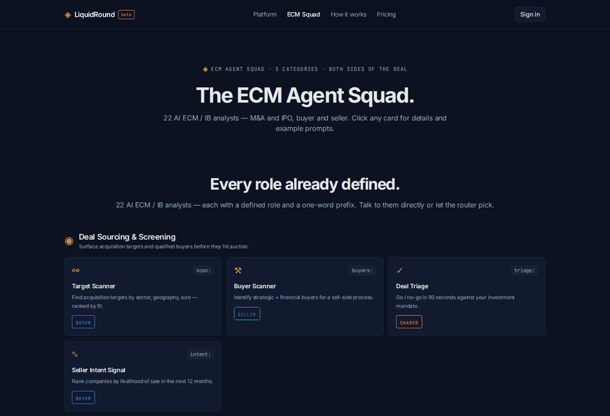
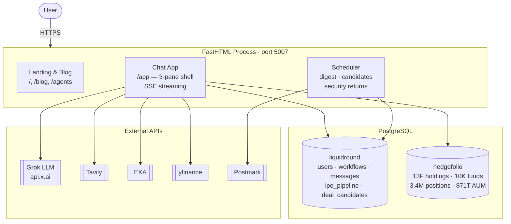
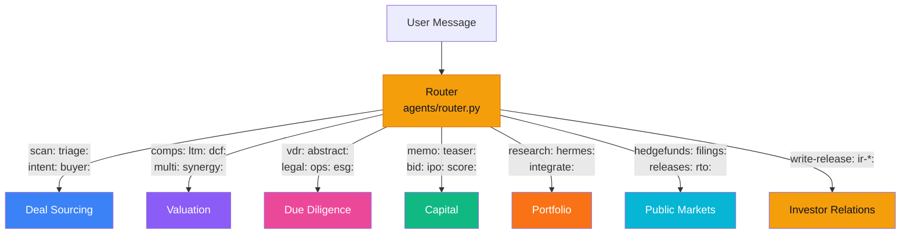

# LiquidRound

**AI ECM Agent Squad for M&A, IPO & Public Markets**

[liquidround.ai](https://liquidround.ai) · Predictive Labs Ltd



LiquidRound is an AI-powered chat-first workspace for investment banking and equity capital markets. A squad of specialist AI agents covers the full deal lifecycle — buyer-led sourcing and diligence, seller-led positioning and IPO readiness, and public markets intelligence.

## Architecture



## What it does

- **Buy-side M&A** — find acquisition targets, run diligence, score matches, build IC memos
- **Sell-side M&A** — prepare teasers / CIMs, identify buyers, assess IPO readiness
- **Public Markets** — IPO tracking (map, pipeline, prospectus), SPAC lifecycle dashboard
- **Hedge Fund Intelligence** — SEC 13F institutional holdings, fund AUM rankings, activist filings
- **BYOD** — upload pitch books, CIMs, term sheets; agents read, cite, and draft from them

## AI Agent Squad

32 specialist agents across 7 categories. The auto-router picks the right agent from natural language, or use a prefix shortcut (`scan:`, `dcf:`, `memo:`, `hermes:`, `hedgefunds:`, `rto:`, `ir-triage:`, etc.).



<table>
<tr>
<td width="33%">

**🔍 Deal Sourcing** (4)
- Target Scanner
- Buyer Scanner
- Deal Triage
- Seller Intent

</td>
<td width="33%">

**📊 Valuation & Underwriting** (6)
- Company Profiler
- Comps Finder
- LTM Normalizer
- DCF Valuer
- Multiples Valuer
- Synergy Analyst

</td>
<td width="33%">

**📋 Due Diligence** (5)
- VDR Auditor
- Contract Abstractor
- Legal Reviewer
- Operational DD
- ESG Reviewer

</td>
</tr>
<tr>
<td>

**💼 Deal Execution & Capital** (5)
- IC Memo Writer
- Teaser Designer
- Bid Strategist
- IPO Readiness
- Match Scorer

</td>
<td>

**🔬 Research & Post-Deal** (3)
- Research Analyst
- Hermes Orchestrator
- Integration Planner

</td>
<td>

**📈 Public Markets** (4)
- Hedge Fund Analyst
- SEC Filing Analyst
- Press Release Analyst
- Reverse Merger Analyst

</td>
</tr>
<tr>
<td>

**✉ Investor Relations** (5)
- IR Event Triage
- Press Release Writer
- IR Compliance Reviewer
- IR Publish Agent
- IR Distribution Planner

</td>
</tr>
</table>

See [`docs/architecture_readme.md`](docs/architecture_readme.md) for the full architecture documentation with 11 Mermaid diagrams.

## Key Features

### Chat Interface
Three-pane layout: left nav (sessions, agents, workspace), center chat with streaming responses, and an always-visible desktop news/context pane. On mobile, context opens from the floating News control.

### Public Markets Dashboard
- **IPO Map** — global treemap sized by market cap, colored by post-IPO performance (RdYlGn)
- **IPO Pipeline** — upcoming US IPOs from NASDAQ calendar, private mega-caps by sector
- **SPAC Tracker** — KPI cards, annual IPO chart, status donut, searchable table with 13F cross-reference
- **Prospectus Builder** — analyze IPO prospectus documents

### Hedge Fund Treemap
Interactive Plotly treemap of SEC 13F institutional holdings. Filter by fund, min value, and position count. 10K+ funds, 7M+ holdings.

### Workspace
Companies directory, deal pipelines (kanban), daily AI-curated digest, valuation simulator (DCF + multiples), text-to-SQL analytics, virtual data room, document management, deal history.

### Free Tools (no sign-in)
- Market Comparables — sector M&A benchmarks
- Business Valuation — indicative range with AI value drivers
- Find Buyers — strategic and financial buyer matching

### Exports
- **XLSX** — agent tables as formatted spreadsheets
- **DOCX** — IC memos and teasers as Word documents
- **PDF** — memo preview in-app, company cards as branded PDFs

## Quick Start

```bash
uv pip install -r requirements.txt
python main.py                    # starts on port 5007
```

Or with Docker:

```bash
docker compose up --build
```

### Environment

```
XAI_API_KEY=...          # primary LLM (Grok via x.ai)
OPENAI_API_KEY=...       # fallback LLM
EXA_API_KEY=...          # semantic search
TAVILY_API_KEY=...       # web search
DB_URL=postgresql://...  # PostgreSQL
SESSION_SECRET=...       # session cookie signing
PUBLIC_BASE_URL=https://liquidround.ai
ALLOWED_ORIGINS=https://liquidround.ai,https://liquidround.com
AGENT_TIMEOUT_SECONDS=120
AGENT_RECURSION_LIMIT=24
AGENT_MAX_TOOL_CALLS=12

# Optional bounded delegation to an independently installed Hermes CLI
HERMES_ENABLED=false
HERMES_COMMAND=hermes
HERMES_MODEL=
HERMES_PROVIDER=
HERMES_TOOLSETS=
HERMES_TIMEOUT_SECONDS=90
HERMES_SAFE_MODE=true
```

At least one of `XAI_API_KEY` or `OPENAI_API_KEY` is required.

## Testing

```bash
python -m scripts.validate_migrations  # ordered migration manifest
python -m evals.run_agent_routing_100  # deterministic 100-question routing eval
pytest -q                              # unit/integration tests
pytest -q tests/test_registry.py       # agent registry integrity
pytest -q tests/test_e2e_smoke.py -m e2e  # Playwright E2E (requires server on :5007)
```

## Tech Stack

- **Backend** — Python, FastHTML, HTMX, LangGraph, LangChain
- **LLM** — Grok (x.ai) or OpenAI via `utils/llm_factory`
- **Database** — PostgreSQL (`liquidround` + `hedgefolio` schemas)
- **Charts** — Plotly.js (treemaps, bar, donut, histograms)
- **Styling** — Tailwind CSS (CDN), custom dark navy + amber palette
- **Data** — yfinance, SEC EDGAR, Exa, Tavily, NASDAQ calendar
- **Deploy** — Docker Compose on Coolify, Postmark for email

## Data Pipelines

```bash
python -m scripts.sync_spacs --enrich       # SPAC data (NASDAQ + EDGAR + yfinance)
python -m scripts.download_sec_13f          # quarterly 13F institutional holdings
python -m scripts.sync_activist             # daily 13D/G activist filings
python -m scripts.daily_deals --all         # send daily digest to opted-in users
```

## License

Proprietary — Predictive Labs Ltd. All rights reserved.

---

**Predictive Labs Ltd** · [liquidround.ai](https://liquidround.ai)
