# LiquidRound — Architecture

LiquidRound is Predictive Labs' AI platform for M&A deal origination,
hedge fund intelligence, and IPO pipeline tracking. It is built on
**FastHTML** (server-rendered hypermedia) with a **LangGraph multi-agent system**
(the "ECM Agent Squad") and a **PostgreSQL** data layer spanning two schemas.

This document covers the system architecture with Mermaid diagrams.
Render these in any Mermaid-compatible viewer (GitHub, VS Code, etc.).

---

## 1. High-Level System Architecture

The platform runs as a single FastHTML process serving both the
public-facing landing site and the authenticated chat application.

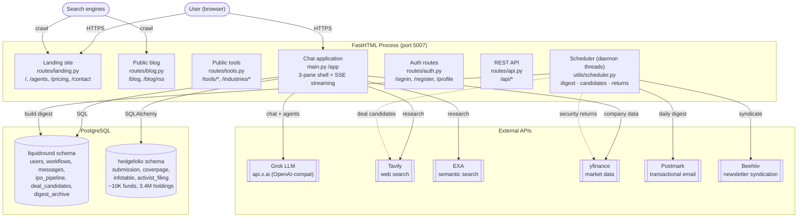

---

## 2. ECM Agent Squad — Multi-Agent Router

32 specialist agents organised into 7 categories. The typed router uses
prefix match → direct intent → keyword heuristics → context refinement →
LLM fallback.

```mermaid
flowchart TD
    MSG["User Message"] --> ROUTER["Router<br/>(agents/router.py)"]

    ROUTER -->|"scan: triage: intent:<br/>buyer:"| SRC["Deal Sourcing<br/>& Screening"]
    ROUTER -->|"comps: ltm: dcf:<br/>multi: synergy:"| UND["Valuation<br/>& Underwriting"]
    ROUTER -->|"vdr: abstract: legal:<br/>ops: esg:"| DIG["Due Diligence<br/>Stack"]
    ROUTER -->|"memo: teaser: bid:<br/>ipo: score:"| CAP["Deal Execution<br/>& Capital"]
    ROUTER -->|"research: hermes: integrate:"| PORT["Research<br/>& Post-Deal"]
    ROUTER -->|"hedgefunds: filings:<br/>releases: rto:"| PUB["Public Markets<br/>& Hedge Funds"]
    ROUTER -->|"write-release:<br/>ir-*:"| IR["Investor Relations<br/>& Communications"]

    subgraph SRC_AGENTS ["Sourcing (4 agents)"]
        SRC --> TS["target_scanner"]
        SRC --> BS["buyer_scanner"]
        SRC --> DT["deal_triage"]
        SRC --> SI["seller_intent"]
    end

    subgraph UND_AGENTS ["Underwriting (6 agents)"]
        UND --> CP["company_profiler"]
        UND --> CF["comps_finder"]
        UND --> LN["ltm_normalizer"]
        UND --> DV["dcf_valuer"]
        UND --> MV["multiples_valuer"]
        UND --> SA["synergy_analyst"]
    end

    subgraph DIG_AGENTS ["Diligence (5 agents)"]
        DIG --> VA["vdr_auditor"]
        DIG --> CA["contract_abstractor"]
        DIG --> LR2["legal_reviewer"]
        DIG --> OD["operational_dd"]
        DIG --> ER["esg_reviewer"]
    end

    subgraph CAP_AGENTS ["Capital (5 agents)"]
        CAP --> ICM["ic_memo_writer"]
        CAP --> TD["teaser_designer"]
        CAP --> BID["bid_strategist"]
        CAP --> IPO["ipo_readiness"]
        CAP --> MS["match_scorer"]
    end

    subgraph PORT_AGENTS ["Portfolio (3 agents)"]
        PORT --> RA["research_analyst"]
        PORT --> HO["hermes_orchestrator"]
        PORT --> IP["integration_planner"]
    end

    subgraph PUB_AGENTS ["Public Markets (1 agent)"]
        PUB --> HFA["hedge_fund_analyst"]
    end

    style ROUTER fill:#F59E0B,color:#0B1220,stroke:#D97706
    style SRC fill:#3B82F6,color:#fff
    style UND fill:#8B5CF6,color:#fff
    style DIG fill:#EC4899,color:#fff
    style CAP fill:#10B981,color:#fff
    style PORT fill:#F97316,color:#fff
    style PUB fill:#06B6D4,color:#fff
```

### Routing priority

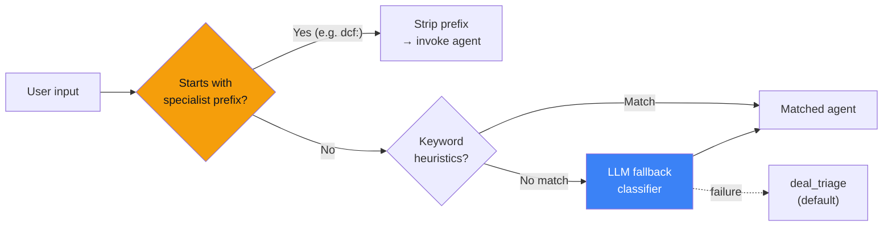

---

## 3. Two Chat Entry Paths

The platform has two parallel chat pathways that share the same agent
registry and tool layer.

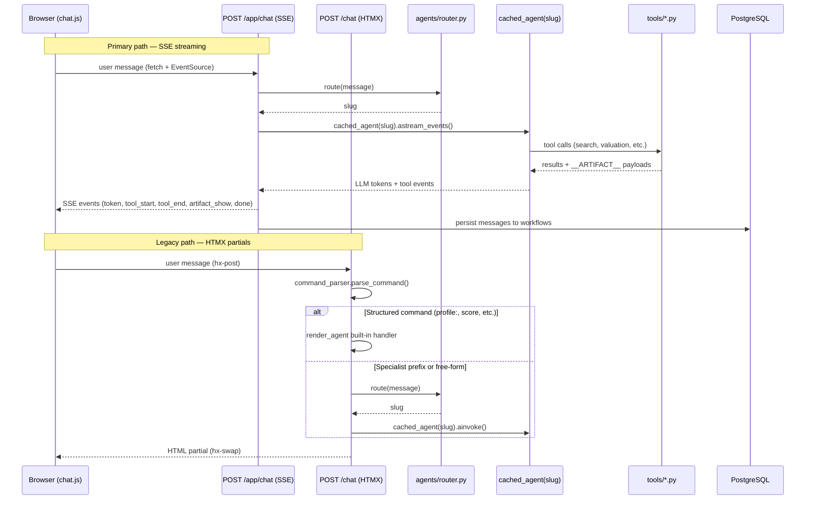

---

## 4. FastHTML 3-Pane Application Shell

The `/app` route renders a responsive 3-pane layout powered by
`components/chat_shell.py` with SSE-driven updates.

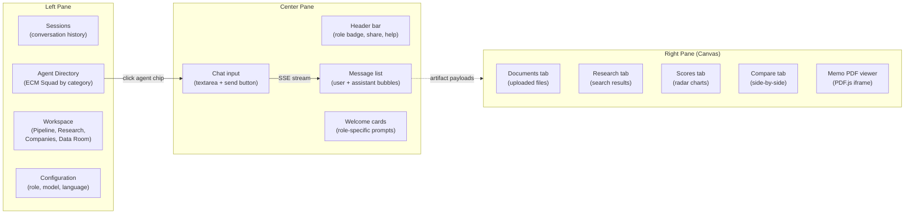

---

## 5. Tools Layer

LangChain `StructuredTool` wrappers consumed by the 23 LangGraph agents.
Tools emit structured data + `__ARTIFACT__` payloads for the canvas pane.

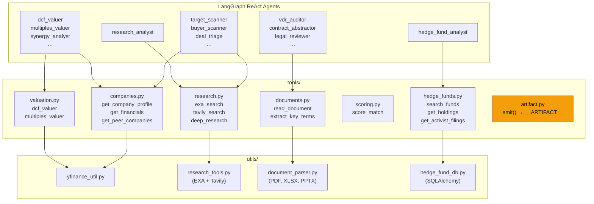

---

## 6. Data Model

Two PostgreSQL schemas on the same database instance.

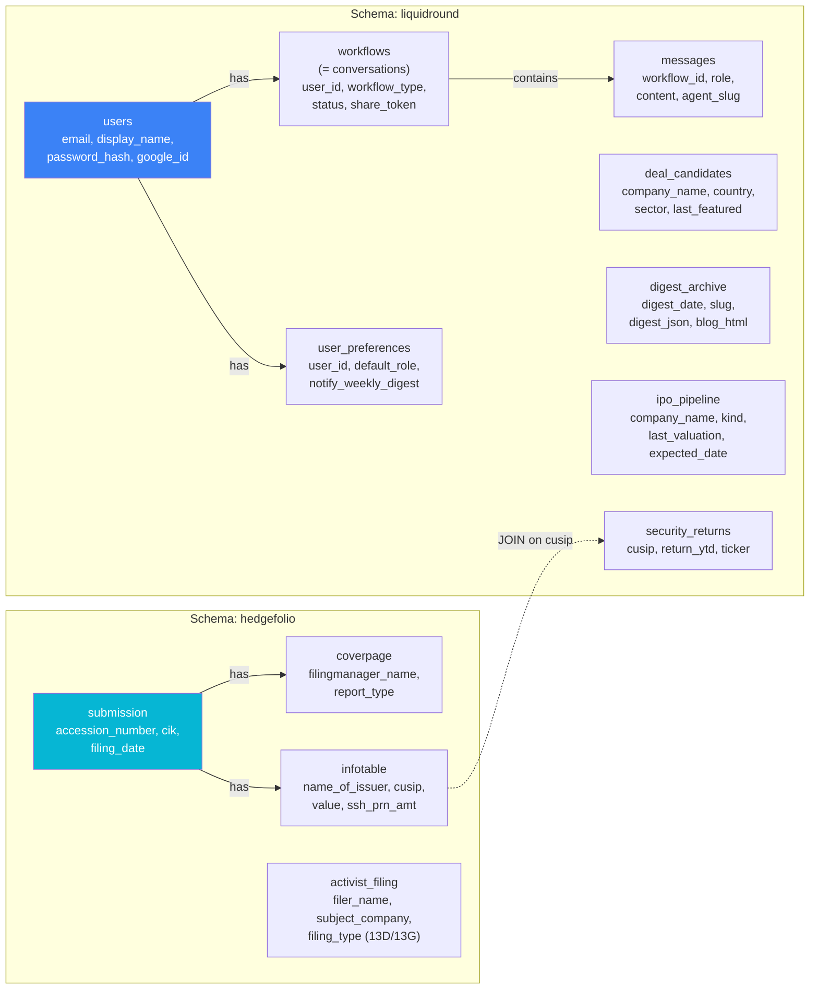

---

## 7. Daily Digest Pipeline

The digest runs as a scheduled job (07:00 UTC daily). It builds
an email with 5 deal candidates, a deep dive, hedge fund leaderboard,
and IPO snapshot — then archives to the blog and syndicates to Beehiiv.

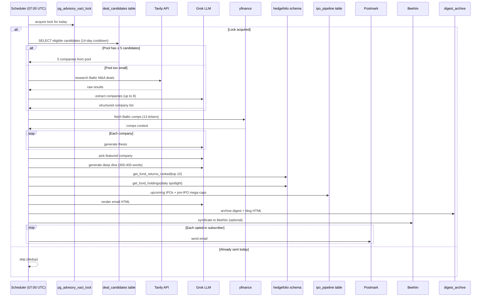

### Deal candidate sync (05:00 UTC)

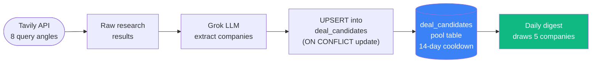

---

## 8. Route Map

All routes served by the FastHTML process, grouped by access level.

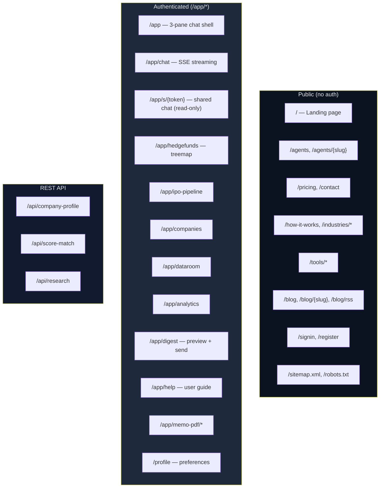

---

## 9. Deployment

The app runs as a Docker container on Coolify (self-hosted PaaS) with
auto-deploy on push to `main`. Zero-downtime deploys overlap old and new
containers briefly — a `pg_advisory_xact_lock`-based dedup lock prevents
the scheduler from double-firing during the overlap window.

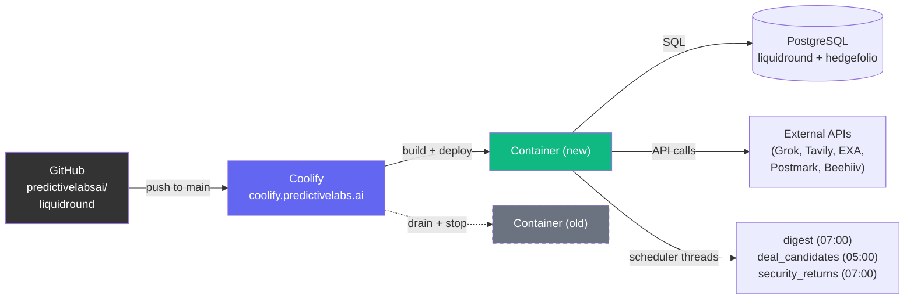
