# LiquidRound

## User Guide — AI ECM / IB Analyst Squad for M&A, IPO & Public Markets

Version 0.4.0 · Predictive Labs Ltd · Live at **liquidround.ai**

An AI-powered M&A, IPO readiness, and public markets intelligence platform.
A squad of specialist AI agents — buyer-led sourcing and diligence, seller-led positioning
and IPO readiness, and public markets intelligence — in one chat-first workspace.

---

## Table of Contents

---

## What this platform is for

**LiquidRound is the AI ECM / IB analyst squad** — a chat-first workspace where
every question routes to the right specialist agent automatically.

- **Buy-side:** Find acquisition targets, run diligence, score matches, and draft IC memos.
- **Sell-side:** Prepare for sale (teasers / CIMs), identify buyers, and assess IPO readiness.
- **Public markets:** Explore SEC 13F institutional holdings, fund AUM rankings, activist filings, IPO tracking, and SPAC lifecycle data.
- **BYOD:** Upload your own pitch books, CIMs, and term sheets — agents read, cite, and draft from them.

> The whole product answers one question: **"Who should we look at, what is it
> worth, and what are the risks — ready for IC?"**

---

## Getting started

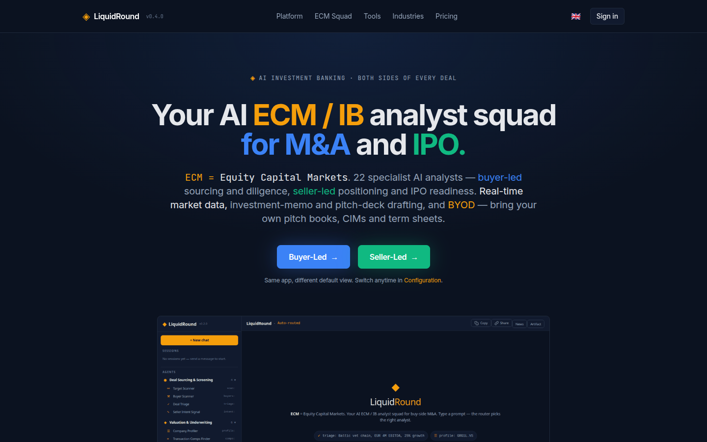

Open **liquidround.ai** and choose your side:

- **Buyer-Led** — the app defaults to sourcing, diligence, and valuation agents.
- **Seller-Led** — the app defaults to positioning, teaser, and IPO readiness agents.

Sign in or register to save sessions, conversations, and pipelines. Guest users
can still use the full chat with in-memory sessions.

---

## The platform — one system, every stage

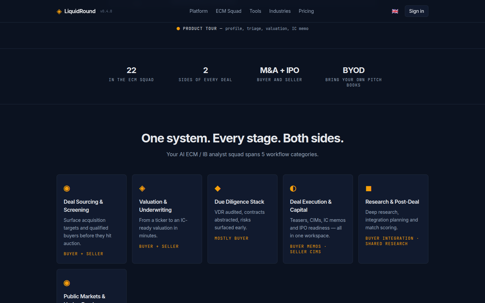

Your ECM / IB analyst squad spans 6 workflow categories:

- **Deal Sourcing & Screening** (4 agents) — target scanning, buyer scanning, deal triage, seller intent
- **Valuation & Underwriting** (6 agents) — company profiling, DCF, comps, LTM, multiples, synergy
- **Due Diligence Stack** (5 agents) — VDR audit, contract abstraction, legal, operational, ESG
- **Deal Execution & Capital** (5 agents) — IC memo, teaser, bid strategy, IPO readiness, integration
- **Research & Post-Deal** (2 agents) — research analyst, match scorer
- **Public Markets & Hedge Funds** (1 agent) — SEC 13F holdings, fund AUM, activist filings

---

## Sign in

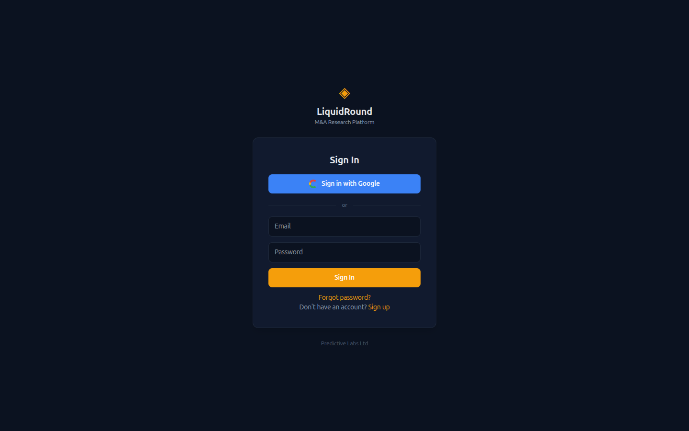

Email + password or **Sign in with Google**. Registration is free. Signed-in users
get persistent conversations, share links, and saved pipelines.

---

## The chat interface — your primary workspace

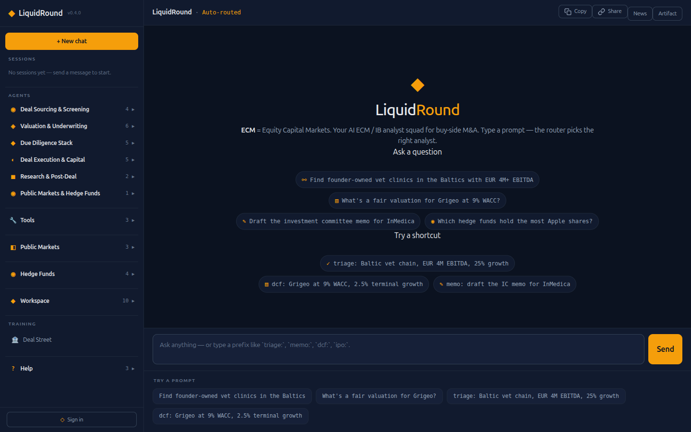

The screen has **three panes** that stay consistent everywhere:

- **Left** — navigation: Sessions, Agents (6 categories), Tools, Public Markets, Hedge Funds, Workspace, Training, Help.
- **Centre** — the chat: welcome hero with example prompts, message thread, and input bar.
- **Right** — the artifact canvas: News, Artifact tabs for agent-produced tables, charts, citations, and PDF previews.

### Ask a question

Type a natural-language question — *"Find founder-owned vet clinics in the Baltics
with EUR 4M+ EBITDA"* — and the **auto-router** picks the best agent.

### Try a shortcut

Use a **prefix command** to route directly to a specific agent:

| Prefix | Agent | What it does |
|--------|-------|-------------|
| `profile:` | Company Profiler | Look up a company by ticker |
| `scan:` | Target Scanner | Find acquisition targets |
| `buyers:` | Buyer Scanner | Identify strategic/financial buyers |
| `triage:` | Deal Triage | Quick deal screening |
| `intent:` | Seller Intent | Analyze seller motivation |
| `dcf:` | DCF Valuer | Discounted cash flow model |
| `multi:` | Multiples Valuer | EV/Revenue, EV/EBITDA comps |
| `comps:` | Comps Finder | Comparable transactions |
| `ltm:` | LTM Normalizer | Normalize trailing-twelve-month P&L |
| `synergy:` | Synergy Analyst | Revenue and cost synergy modelling |
| `score` | Match Scorer | 7-dimension buyer-target scoring |
| `vdr:` | VDR Auditor | Audit data room completeness |
| `abstract:` | Contract Abstractor | Extract key terms from contracts |
| `legal:` | Legal Reviewer | Open litigation and legal risk |
| `ops:` | Operational DD | Working capital and operations review |
| `esg:` | ESG Reviewer | Environmental, social, governance screening |
| `memo:` | IC Memo Writer | Draft an investment committee memo |
| `teaser:` | Teaser Designer | Blind teaser for sell-side |
| `bid:` | Bid Strategist | Cash/stock mix and offer structuring |
| `ipo:` | IPO Readiness | Assess public offering readiness |
| `integrate:` | Integration Planner | Post-merger 100-day plan |
| `research:` | Research Analyst | Deep web + semantic research |
| `hedgefunds:` | Hedge Fund Analyst | SEC 13F holdings, fund AUM, activist filings |

---

## Agent browser — specialists at a glance

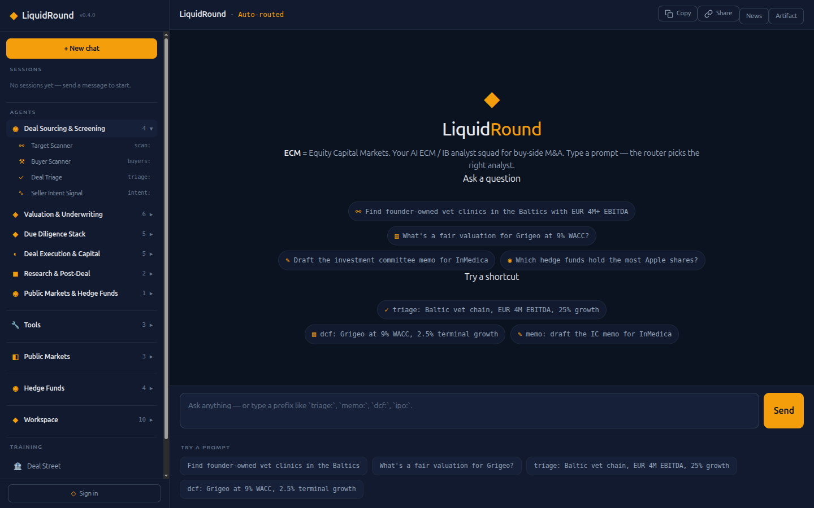

Click any **agent category** in the left nav to expand it. Each agent shows its
name and prefix shortcut. Click an agent to fill the chat input with a sample
question — the router picks up automatically.

Each agent has its own system prompt and tool set. View and customize prompts in
**Workspace → Instructions**.

---

## Hedge Fund Intelligence

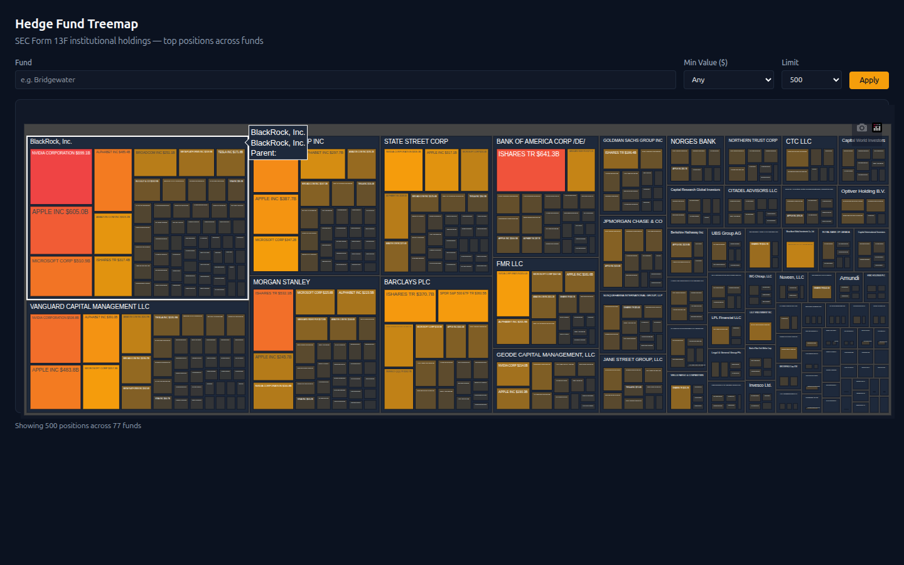

Interactive Plotly treemap at **Hedge Funds → Fund Treemap** showing SEC Form 13F
institutional holdings. Cell size is proportional to portfolio value.

**Filter controls:**
- **Fund** — search for a specific fund manager (e.g. "Bridgewater", "Vanguard")
- **Min Value ($)** — filter positions by minimum value ($1M, $10M, $100M, $1B)
- **Limit** — number of positions to display (200, 500, 1000)

Click **Apply** to refresh the treemap.

### Chat commands

Click these in the left nav or type the prefix in chat:

- **Top Holdings** — `hedgefunds: top funds by AUM`
- **Popular Securities** — `hedgefunds: most popular securities across all funds`
- **Activist Filings** — `hedgefunds: recent activist filings`
- **Fund Search** — `hedgefunds: search for Bridgewater`

### Data source

All hedge fund data comes from SEC Form 13F filings — mandatory quarterly
disclosures by institutional investment managers with over $100M in qualifying
assets. Approximately **10,000+ fund managers** and **7 million+ holdings** in
the database.

---

## Public Markets

### IPO Map

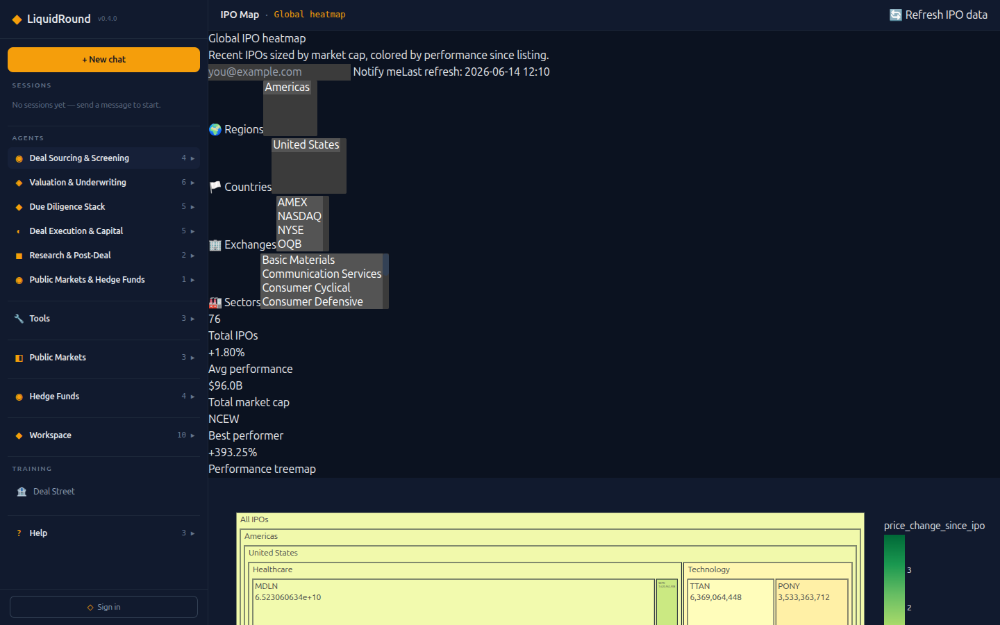

Global IPO heatmap — recent IPOs sized by market cap, colored by performance since
listing. Filter by region, country, exchange, and sector. KPIs: total IPOs, average
performance, total market cap, best performer.

### IPO Pipeline

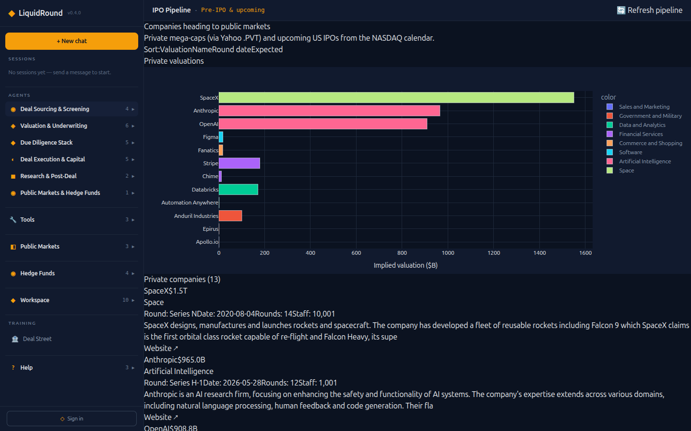

Track private mega-caps and upcoming US IPOs from the NASDAQ calendar. Bar chart
by sector, with company details including round, valuation, and description.

### Prospectus

Browse and analyze IPO prospectus documents. Enter a ticker or company name
and the system retrieves SEC filings for prospectus analysis.

### SPAC Tracker

The SPAC Tracker dashboard at **Public Markets → SPACs** provides a full
lifecycle view of Special Purpose Acquisition Companies.

**Dashboard features:**

- **KPI cards** — Active SPACs (searching for target), Total Trust value, Announced Deals, and Average Redemption rate.
- **Annual SPAC IPOs & Proceeds chart** — Plotly bar + line chart showing yearly SPAC IPO volume and capital raised (dual Y-axis).
- **SPACs by Status donut** — visual breakdown of Searching, Announced, Completed, and Liquidated SPACs.
- **Searchable table** — all tracked SPACs with columns: Ticker, Name, Status (color-coded badges), Trust Size, Current Price, NAV Premium %, Target Company, IPO Date, and Exchange. Filter by status, minimum trust size, or free-text search.
- **13F Institutional Holders** — click any SPAC row to expand and view which institutional funds hold that SPAC, cross-referenced from SEC 13F filings in the hedge fund database. Shows fund name, position value, and share count.

**Status lifecycle:**
- **Searching** — SPAC has IPO'd and is looking for an acquisition target
- **Announced** — definitive agreement signed with a target company
- **Completed** — merger closed, shares now trade as the combined entity (de-SPAC)
- **Liquidated** — SPAC failed to find a target before deadline, trust returned to shareholders

**Data sources:** NASDAQ IPO calendar, SEC EDGAR filings, and yfinance for real-time pricing.

**Data refresh:** Run `python -m scripts.sync_spacs --enrich` to update SPAC data with latest prices and new listings.

---

## Free tools — no sign-in required

### Market Comparables

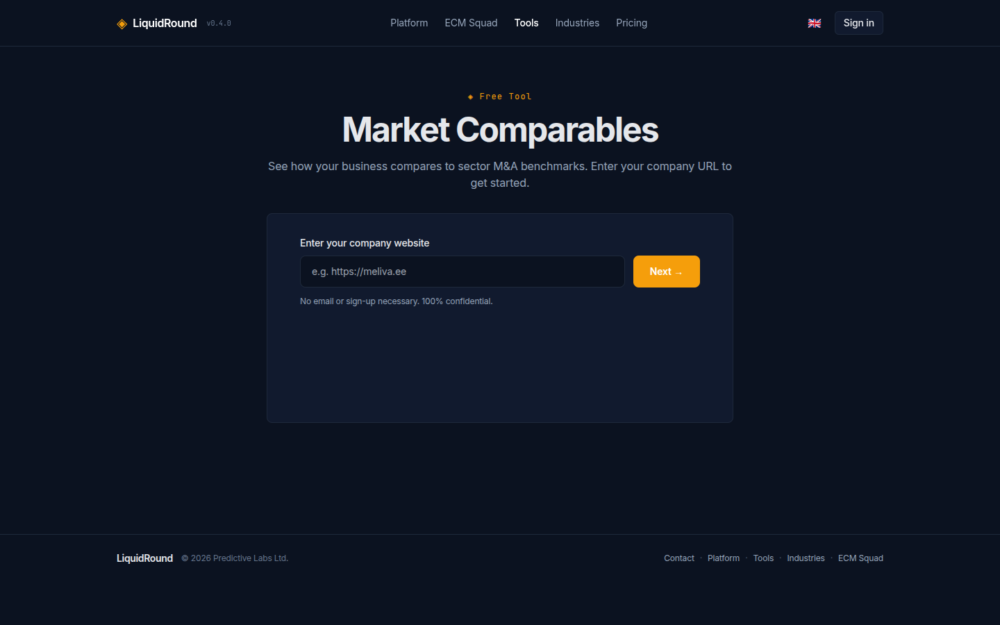

Enter a company URL to get sector M&A benchmarks — EV/Revenue and EV/EBITDA
multiples compared to Damodaran sector averages.

### Business Valuation

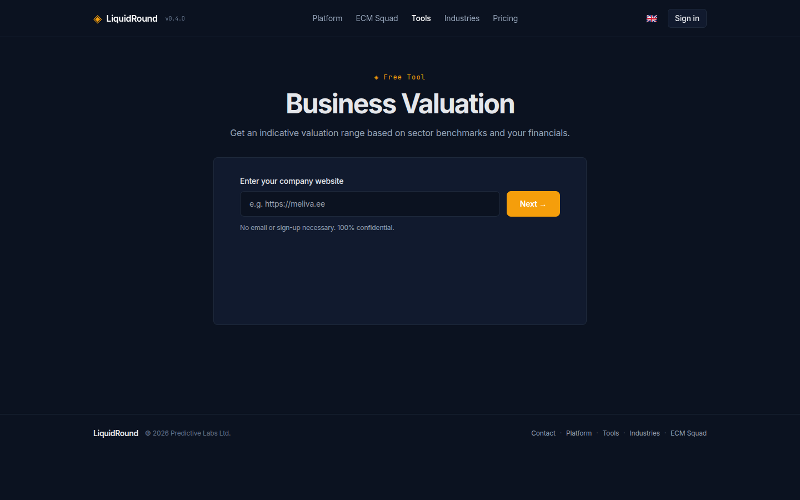

Enter a company URL and basic financials to get an indicative valuation range.
AI-generated value drivers (positive and negative) are included. Supports
human-friendly number input: `1M`, `500k`, `2.5B`, or `1,000,000`.

### Find Buyers

Enter a company URL to identify potential strategic and financial buyers with
match scoring.

All three tools work by scraping the company website, identifying the sector, and
applying relevant multiples and buyer databases. Each ends with a **Book a
15-minute call** lead capture form.

---

## Industries

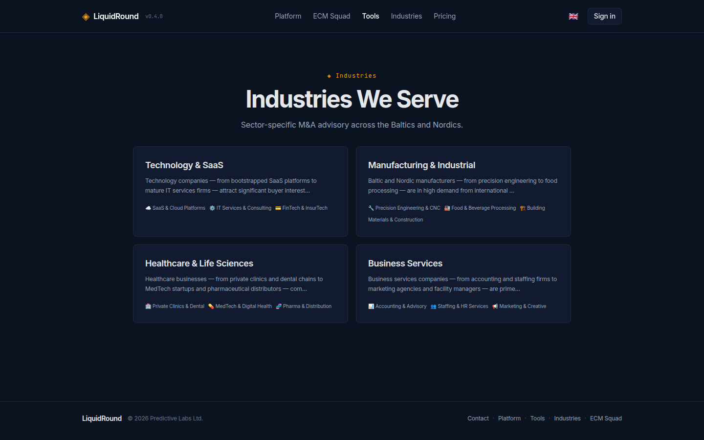

Sector-specific M&A advisory pages across the Baltics and Nordics. Each industry
page includes sector description, sub-sectors, advisor CTAs, and a "Find Buyers"
widget.

---

## Workspace pages

### Companies

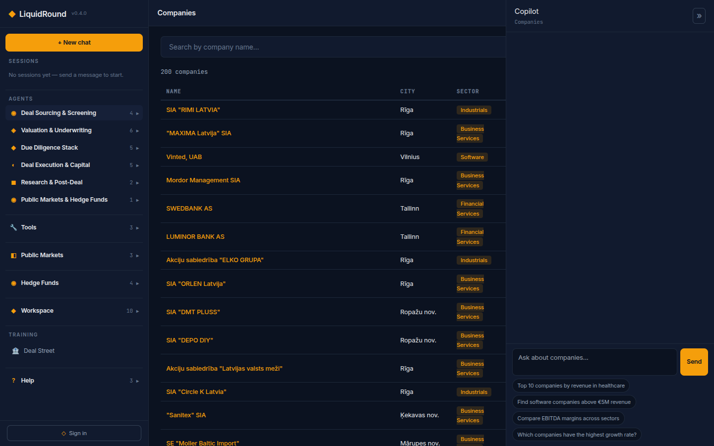

Search the company database by name, sector, or geography. Click a company to see
its full profile with financials, description, and deal brief.

### Pipelines

Track your deal pipeline — add targets or buyers, set deal stages, and monitor
progress. Requires sign-in.

### Daily Deals

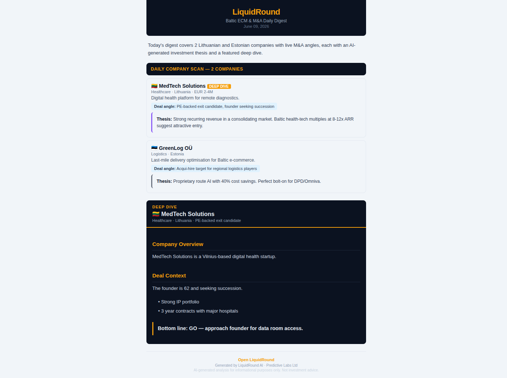

AI-curated daily digest of M&A-relevant companies. Each company gets a deal angle,
investment thesis, and sector comps. The featured company gets a deep dive with
company overview, deal context, and a bottom-line recommendation.

Delivered as a styled email — opt in via your profile preferences.

### Valuation Simulator

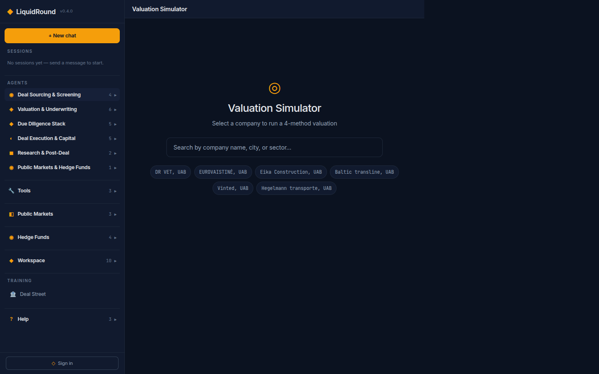

Interactive valuation simulator with 4 methods: EV/Revenue multiples, EV/EBITDA
multiples, DCF (WACC + equity bridge), and combined view. Enter your financials
and adjust assumptions in real time.

### Analytics

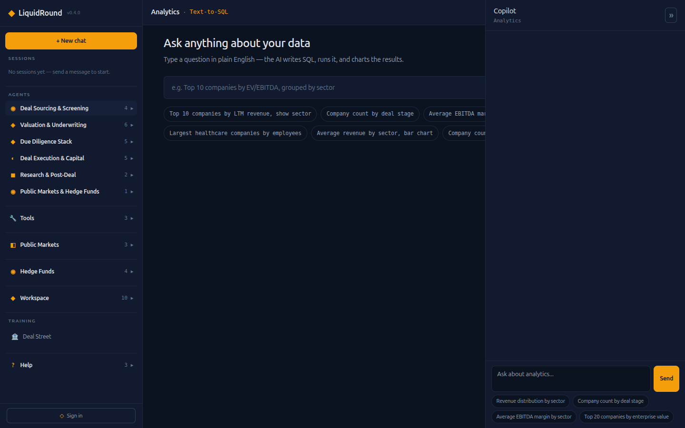

Text-to-SQL analytics — ask questions in plain English and get charts + tables
from the database.

### Data Room

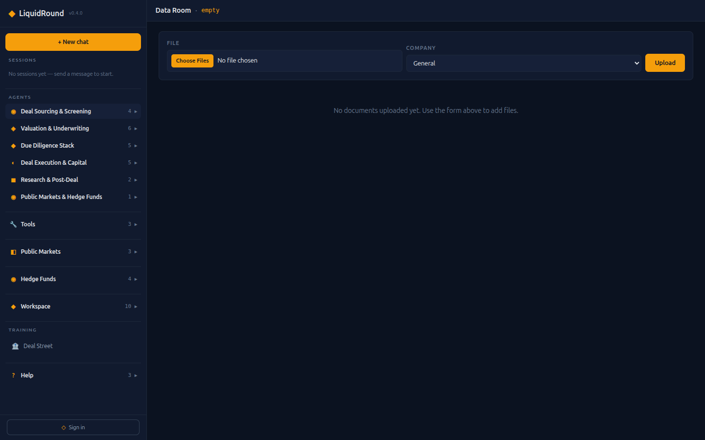

Upload and manage deal documents organized by company. Supports PDF, DOCX, XLSX,
PPTX, CSV, and image files. Drag-and-drop or use the upload button.

### Documents

Browse uploaded documents. Extract key terms or score documents against buyer
criteria.

### Deal History

View your workflow history with charts showing deal types, timeline, and status
distribution.

### Instructions

View and customize agent system prompts to tailor AI behavior to your firm's
standards.

---

## Exports

- **Excel (XLSX)** — when an agent produces a table, click **Download XLSX** for a formatted spreadsheet with styled headers.
- **Word (DOCX)** — IC memos, teasers, and other markdown content export as Word documents via **Download DOCX**.
- **PDF** — IC memos produce a PDF preview in the right pane. Company cards can also be downloaded as branded PDFs.

---

## Configuration

- **Currency** — switch between EUR, GBP, and USD in Configuration.
- **Role** — set your default view to Buyer, Seller, or Both. Affects which agents and suggestions appear first.
- **Number input** — all financial inputs support human-friendly shortcuts: `1M`, `35.5k`, `2B`, `1,000,000`.

---

## Keyboard shortcuts

- **Enter** — send message
- **Shift+Enter** — new line in message

---

## Tips

- Use the **Copy** button to copy all chat messages to clipboard.
- Use the **Share** button to generate a shareable link for your session.
- The **News** tab in the right pane shows live M&A news.
- The **Artifact** tab shows agent-produced tables, charts, and citations.
- Upload documents via the paperclip button or drag-and-drop.
- All collapsible nav sections can be expanded by clicking the section header.

---

## Quick reference

**Navigation**

- *Agents* — 6 categories of specialist AI analysts · *Tools* — Market Comps, Find Buyers, Valuation
- *Public Markets* — IPO Map, IPO Pipeline, Prospectus, SPACs
- *Hedge Funds* — Fund Treemap, Top Holdings, Popular Securities, Activist Filings
- *Workspace* — Companies, Pipelines, Daily Deals, Valuation, Analytics, Data Room, Documents, Deal History, Exports, Instructions
- *Help* — Profile, User Guide, Keyboard shortcuts

**Prefix commands:** `profile:` · `scan:` · `buyers:` · `triage:` · `intent:` · `dcf:` · `multi:` · `comps:` · `ltm:` · `synergy:` · `score` · `vdr:` · `abstract:` · `legal:` · `ops:` · `esg:` · `memo:` · `teaser:` · `bid:` · `ipo:` · `integrate:` · `research:` · `hedgefunds:`

---

LiquidRound v0.4.0 — Predictive Labs Ltd
