# LiquidRound AI Platform Demo

# LiquidRound AI Platform Demo

M&A · IPO · Public Markets · Investor Relations

32 specialist agents · 7 categories · chat-first workspace

Predictive Labs Ltd · LiquidRound v0.8.0

---

## Demo at a glance

1. Open the three-pane workspace — show automatic agent routing.
2. Run a company profile or deep-research prompt in the chat.
3. Expand **Investor Relations** → create a researched press release.
4. Triage a material event with `ir-triage:` — disclosure go/no-go.
5. Export the draft to Markdown, Word, and PDF → save to Data Room.
6. Run `ir-publish:` to finalize into a wire-ready package.
7. Open Public Markets, Deal Radar, Analytics, and Skills.

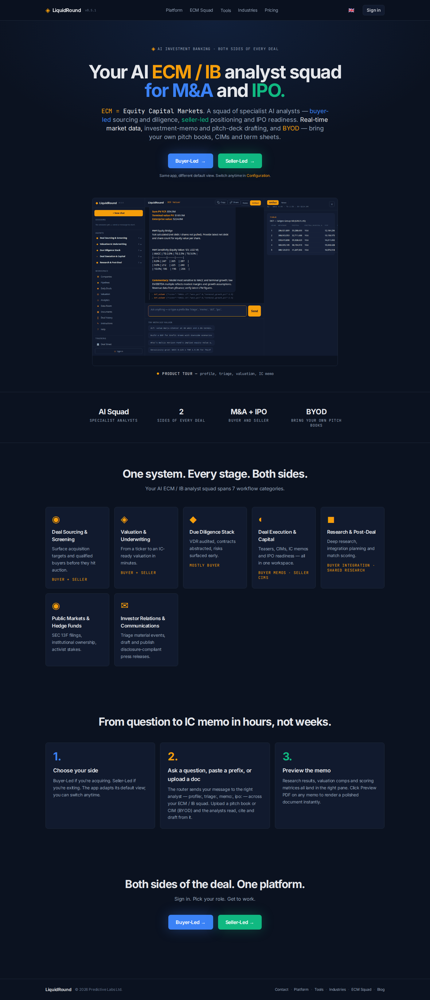

---

## Getting started

Sign in at **liquidround.ai** — choose Buyer-Led or Seller-Led. Three panes: **left** (sessions, 32 agents, Tools, IR, Public Markets), **centre** (routed chat, workspace pages), **right** (live contextual News feed).

On mobile, the left pane becomes a slide-in menu and the contextual feed starts
closed; use the floating **News** control to open it without obscuring the chat.

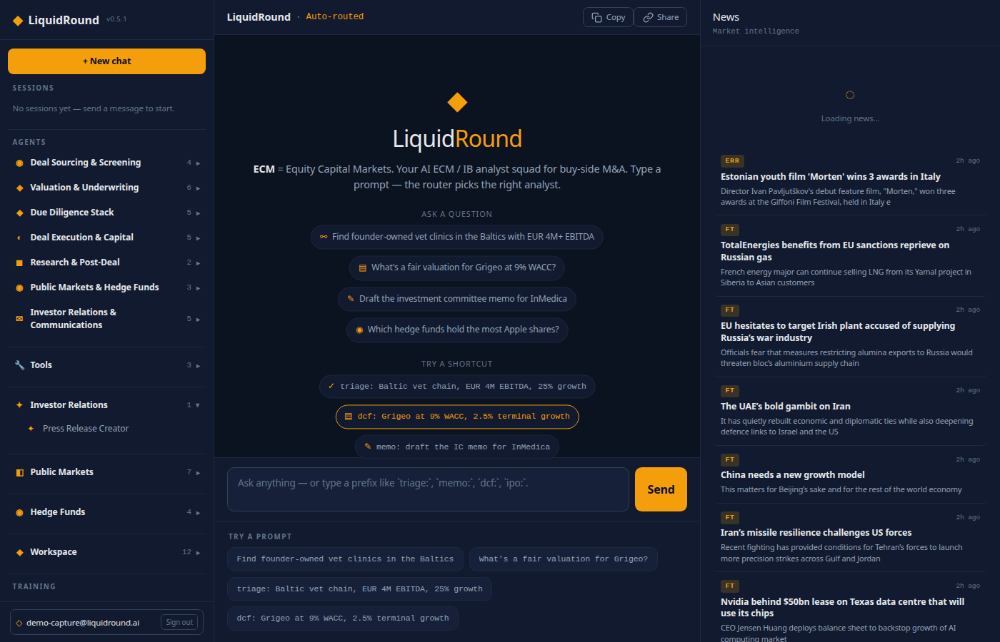

---

## Investor Relations — Press Release Creator

Open **Investor Relations → Press Release Creator** at `/app/investor-relations/press-release`. Only **Topic** is required. The guided brief supports company, release type, language, tone, audience, key facts, quotes, boilerplate, contacts, and embargo.

Press **Research and draft release** — the workflow searches the web, sends evidence to the Press Release Writer, and returns editable Markdown with source notes.

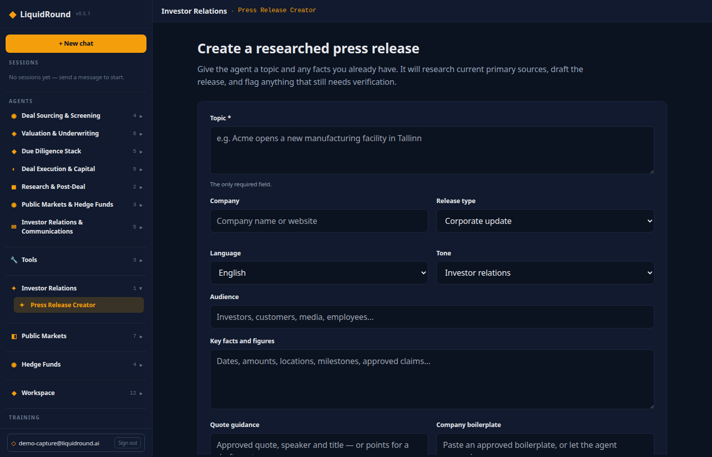

---

## Investor Relations — draft safeguards and exports

The writer produces a news-led headline, dateline, lead, supporting facts, attributed quotes, boilerplate, contacts, and source verification notes. Regulated announcements are flagged for legal review.

**Output actions:** Copy · Markdown · Word · PDF · Save to Data Room.

---

## Investor Relations — the IR agent squad

Five agents cover the full disclosure lifecycle:

- **IR Event Triage** (`ir-triage:`) — materiality go/no-go under Reg FD, MAR, exchange rules.
- **Press Release Writer** (`write-release:`) — research and draft publication-ready releases.
- **IR Compliance Reviewer** (`ir-compliance:`) — Reg FD / MAR compliance check before publish.
- **IR Publish Agent** (`ir-publish:`) — approved draft → wire-ready package + checklist.
- **IR Distribution Planner** (`ir-distribute:`) — wire services, exchanges, investor lists, timing.

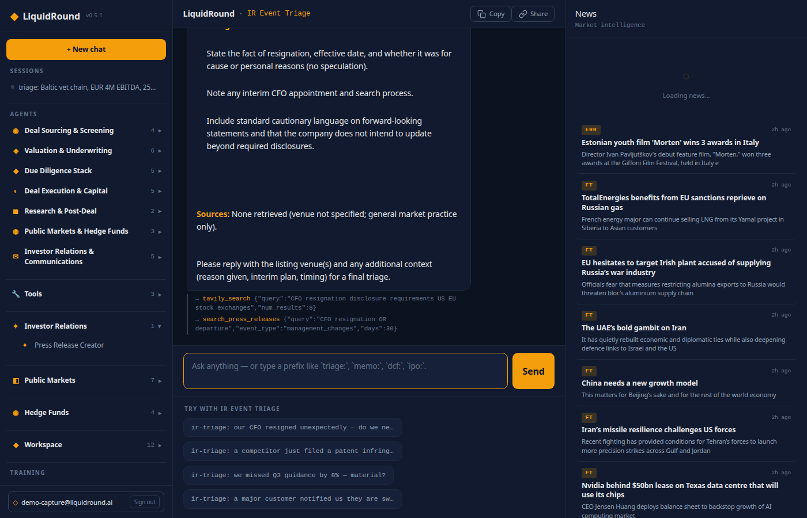

---

## Investor Relations — publish and distribute

Run `ir-publish:` to take an approved draft and produce the final wire-ready package with exchange-compliant formatting and a pre-publish checklist. Then `ir-distribute:` plans wire-service routing, exchange notifications, and cross-timezone timing.

Demo prompts: `ir-triage: CFO resigned`, `ir-compliance: check this draft`, `ir-publish: finalize Q3 earnings`, `ir-distribute: Nordic exchanges`.

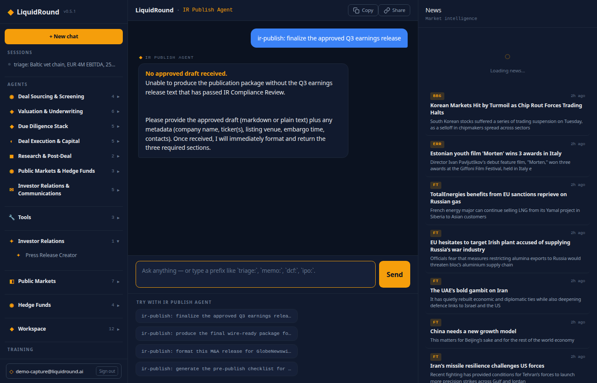

---

## The 32-agent squad — sourcing and underwriting

**Deal Sourcing (4):** Target Scanner (`scan:`), Buyer Scanner (`buyers:`), Deal Triage (`triage:`), Seller Intent (`intent:`). Target Scanner carries mandate filters across follow-up turns, treats omitted filters as open, and proceeds with evidence-backed candidates once sector/product and geography are known.

**Valuation & Underwriting (6):** Company Profiler (`profile:`), Comps Finder (`comps:`), LTM Normalizer (`ltm:`), DCF Valuer (`dcf:`), Multiples Valuer (`multi:`), Synergy Analyst (`synergy:`).

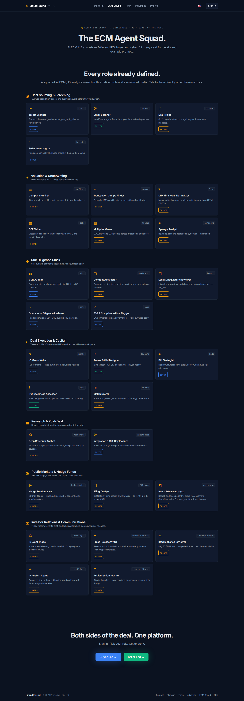

---

## The 32-agent squad — diligence and capital

**Due Diligence (5):** VDR Auditor (`vdr:`), Contract Abstractor (`abstract:`), Legal Reviewer (`legal:`), Operational DD (`ops:`), ESG Flagger (`esg:`).

**Deal Execution & Capital (5):** IC Memo Writer (`memo:`), Teaser/CIM Designer (`teaser:`), Bid Strategist (`bid:`), IPO Readiness (`ipo:`), Match Scorer (`score:`).

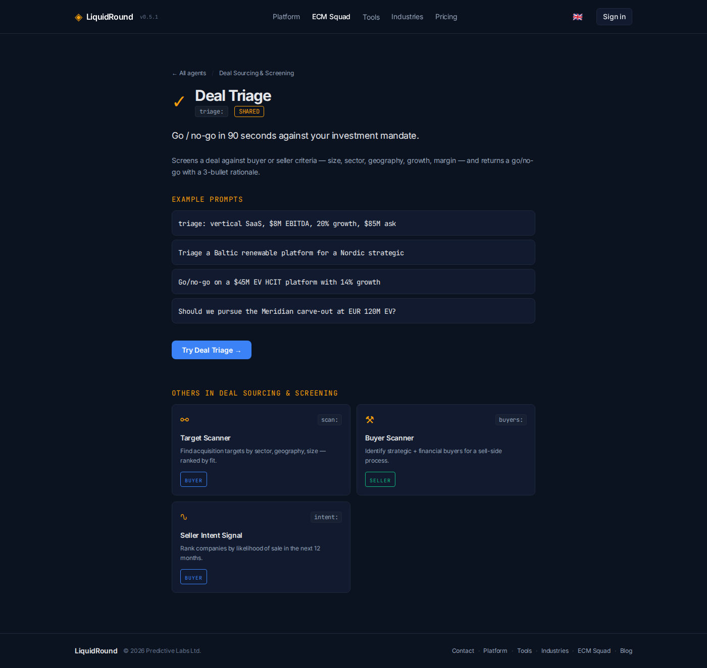

---

## The 32-agent squad — research and public markets

**Research & Post-Deal (3):** Deep Research Analyst (`research:`), Hermes Orchestrator (`hermes:`), Integration Planner (`integrate:`). Hermes is optional and runs inside a bounded LangGraph delegation node with configurable model/provider, safe mode, toolsets, and timeout. All graph runs also enforce configurable recursion, tool-call, and wall-clock limits.

**Public Markets (4):** Hedge Fund Analyst (`hedgefunds:`), Filing Analyst (`filings:`), Press Release Analyst (`releases:`), Reverse Merger Analyst (`rto:`).

**Investor Relations (5):** IR Triage, Press Release Writer, IR Compliance, IR Publish, IR Distribution.

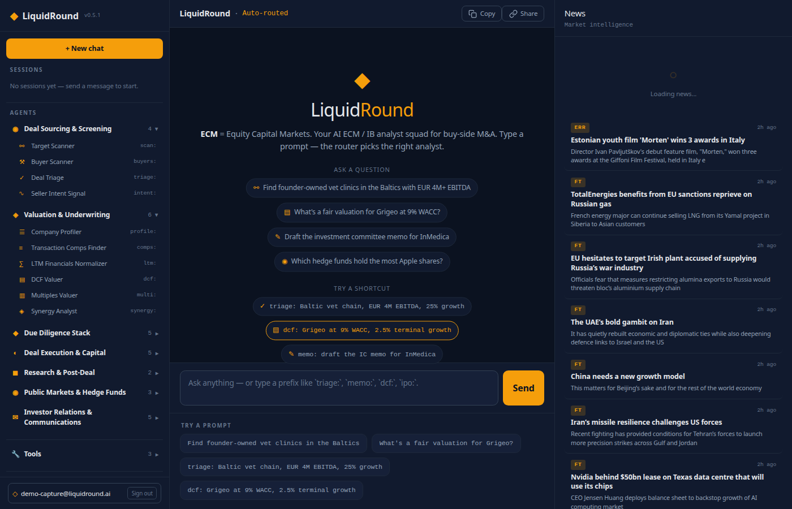

---

## Chat, routing, and artifacts

Ask a natural-language question or use an agent prefix. The router picks the right agent; progress and tool calls stream live. Work products — profiles, tables, citations, charts — render inline. Use **Copy** and **Share** for session links.

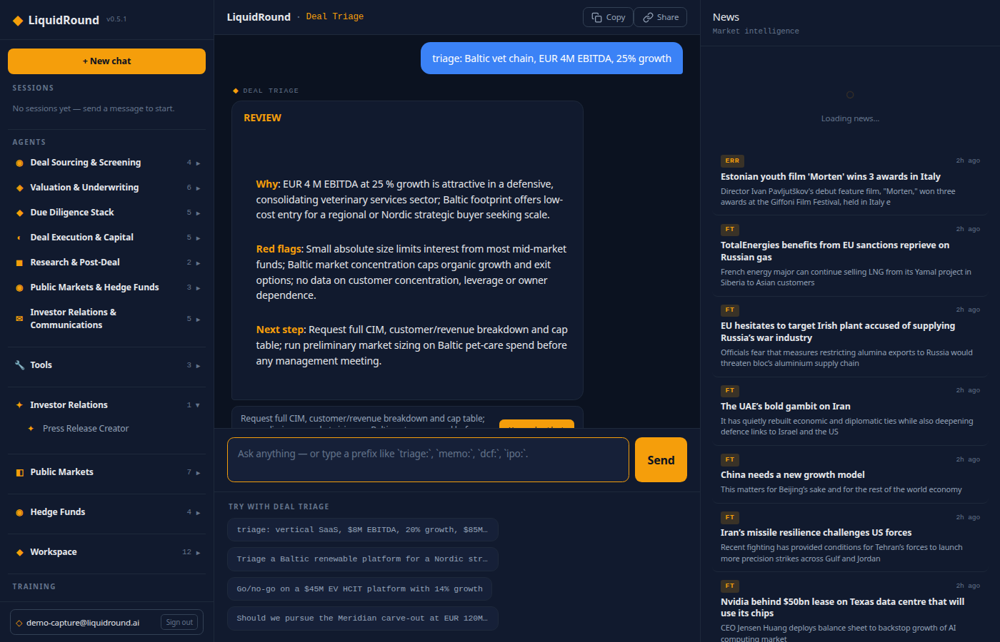

---

## Chat — DCF and IC memo

DCF Valuer builds a five-year model with WACC and terminal-growth sensitivity. IC Memo Writer drafts a full investment-committee memo from workspace data.

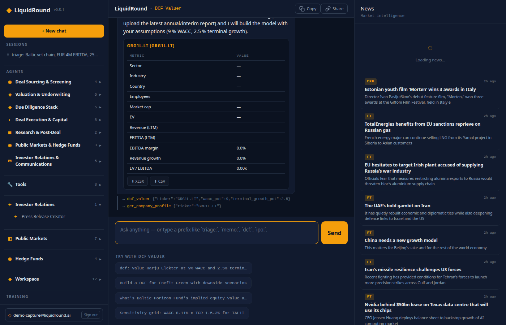

---

## Chat — IPO readiness

IPO Readiness Assessor checks financial, governance, operational, and market readiness for a listing.

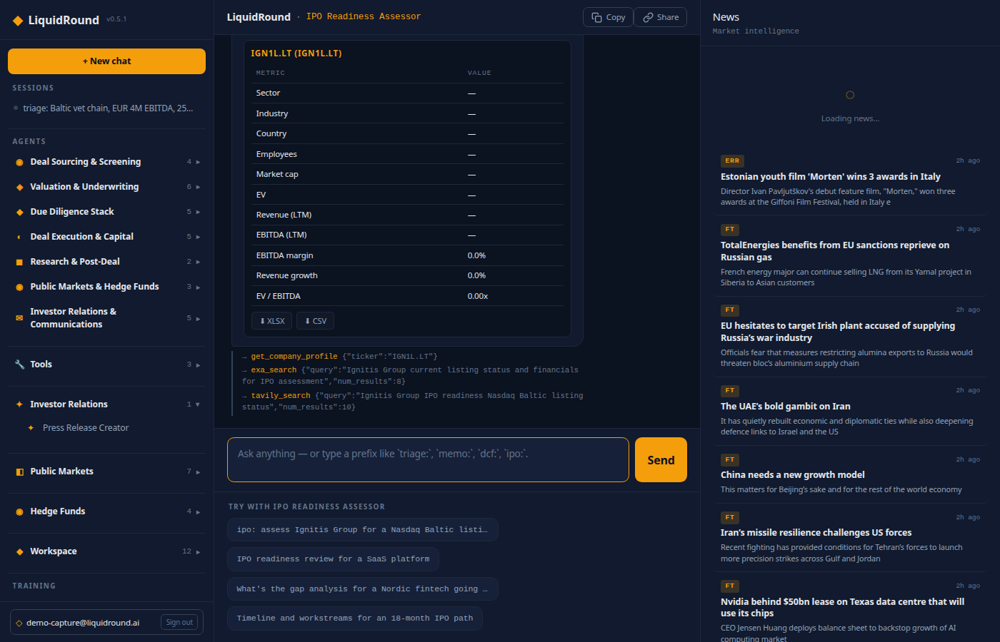

---

## Public Markets — IPO Map and SPACs

The IPO Map shows recent listings sized by market cap, colored by performance. The SPAC Tracker covers searching, announced, completed, and liquidated SPACs with trust values and redemptions.

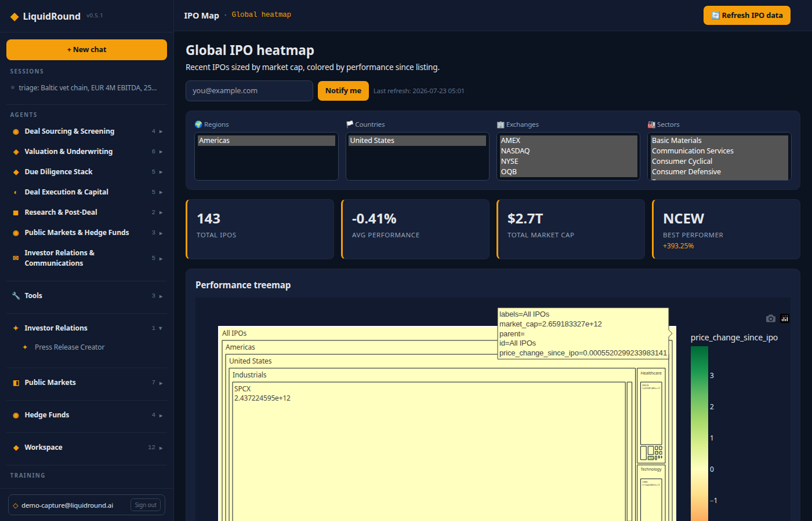

---

## Public Markets — SPAC Tracker

Track SPAC lifecycle, trust values, redemptions, prices, targets, and institutional holders.

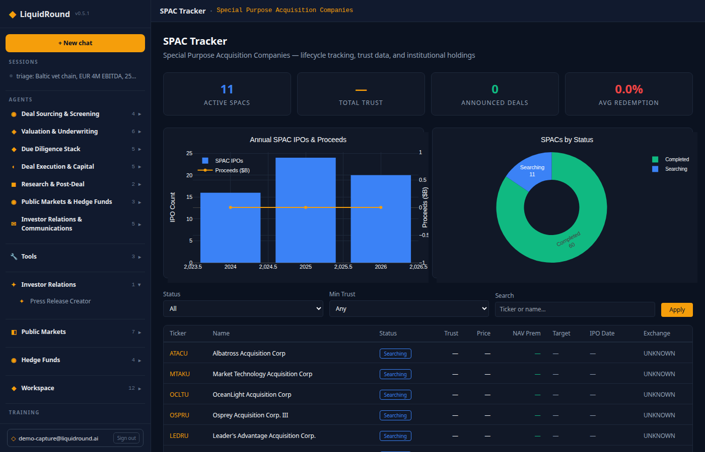

---

## Public Markets — Reverse Mergers

Open **Public Markets → Reverse Mergers** at `/app/reverse-mergers`. Compare
traditional US reverse mergers, reviewed Canadian RTO/CPC records, and SPAC/de-SPAC
transactions in one normalized workspace. Filters cover jurisdiction, status, company,
target, structure, evidence, and deal value. Subtabs separate traditional reverse
mergers from the SPAC comparison and explain the classification methodology.

The three-year US monitor uses SEC EDGAR evidence, especially Form 8-K Items 1.01,
2.01, 5.01, 5.06, and 9.01. Canadian records are discovered from sedarplus.ca via
a headless Chromium scraper that reads the public document search and parses
downloaded filings through the same document-intelligence pipeline as EDGAR. Only
metadata and a content hash are stored; documents are not mirrored. Click **Sync
SEDAR+ (CA)** to run the scraper, or use `rto:` to ask the Reverse Merger Analyst.
See [docs/sedarplus_ingestion.md](#) for the full pipeline documentation.

The **Merger news** subtab monitors merger-specific releases from GlobeNewswire,
Business Wire, and PR Newswire RSS. Filter releases by wire and transaction stage;
the same normalized feed is available to the Reverse Merger Analyst.

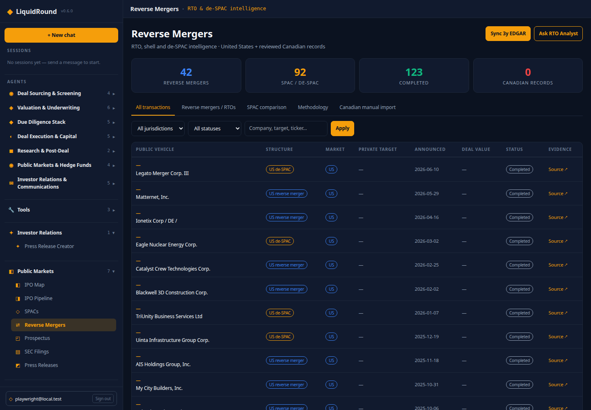

---

## Hedge Fund Intelligence

The Fund Treemap visualizes SEC 13F positions by portfolio value. Search managers, set minimum positions, bookmark funds. Chat shortcuts surface top holdings, popular securities, concentration, and activist 13D/13G filings.

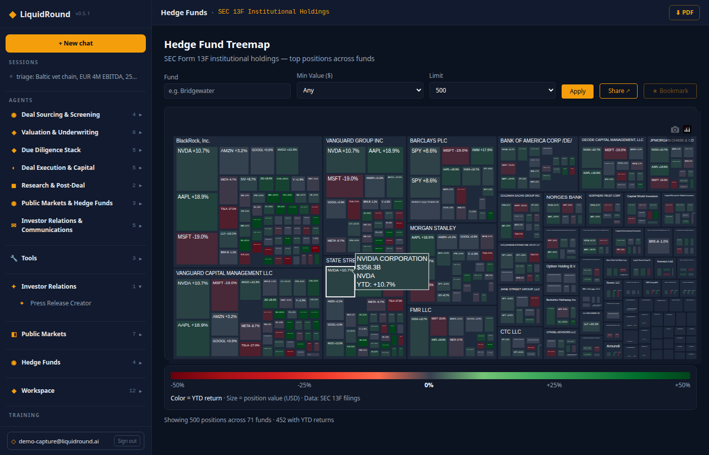

---

## Free public tools

Three no-sign-in workflows: **Market Comparables** (benchmark transaction multiples), **Find Buyers** (score strategic and financial buyers), **Business Valuation** (sector multiples + value drivers). Fields accept shorthand like `1M`, `500k`, `2.5B`.

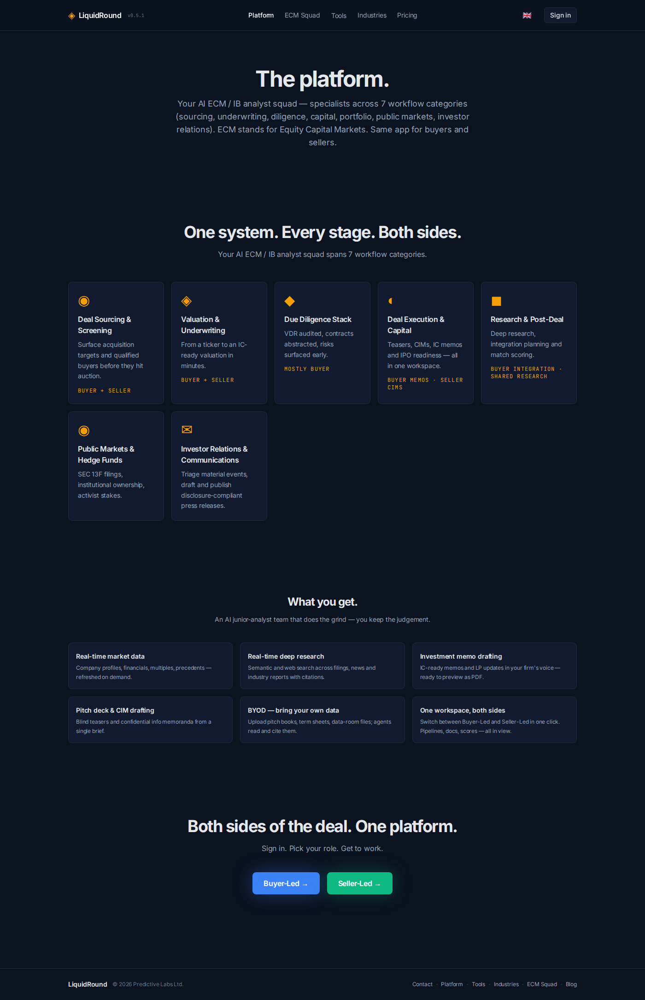

---

## Workspace — companies and pipelines

Search companies by name, sector, geography. Open profiles, financials, deal briefs. Maintain target and buyer pipelines with drag-and-drop stages. Deal Radar ranks synergy pairs. Data Coverage syncs Estonian, Norwegian, and Danish sources.

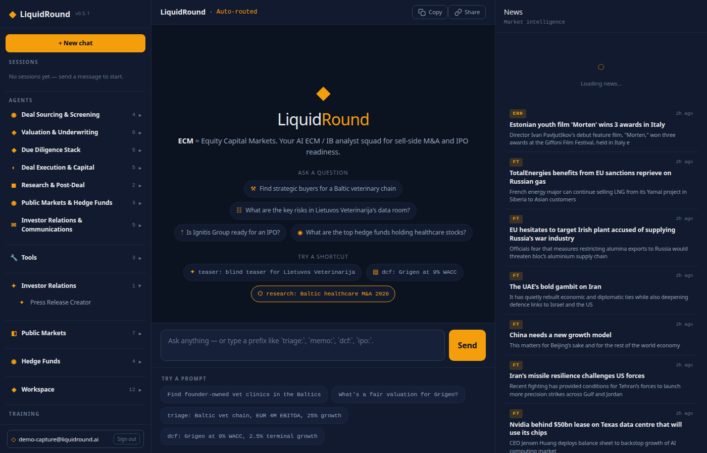

---

## Workspace — valuation, analytics, data room

**Valuation:** EV/Revenue, EV/EBITDA, DCF with adjustable assumptions. **Analytics:** plain-language database queries with tables and charts. **Data Room:** upload, organize, and parse PDF/DOCX/XLSX/PPTX files. IR drafts saved from the Press Release Creator appear here.

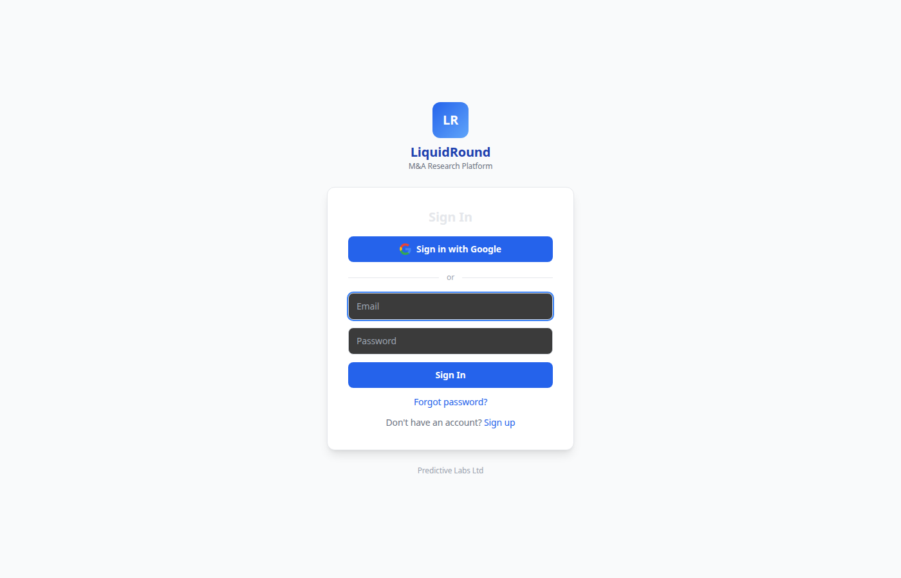

---

## Skills

Open **Workspace → Skills** at `/app/skills` to review and edit the operating prompt for each agent. WYSIWYG and Markdown modes, version history, reverting. Saved changes clear the agent cache immediately.

IR skills: IR Event Triage, Press Release Writer, IR Compliance Reviewer, IR Publish Agent, IR Distribution Planner.

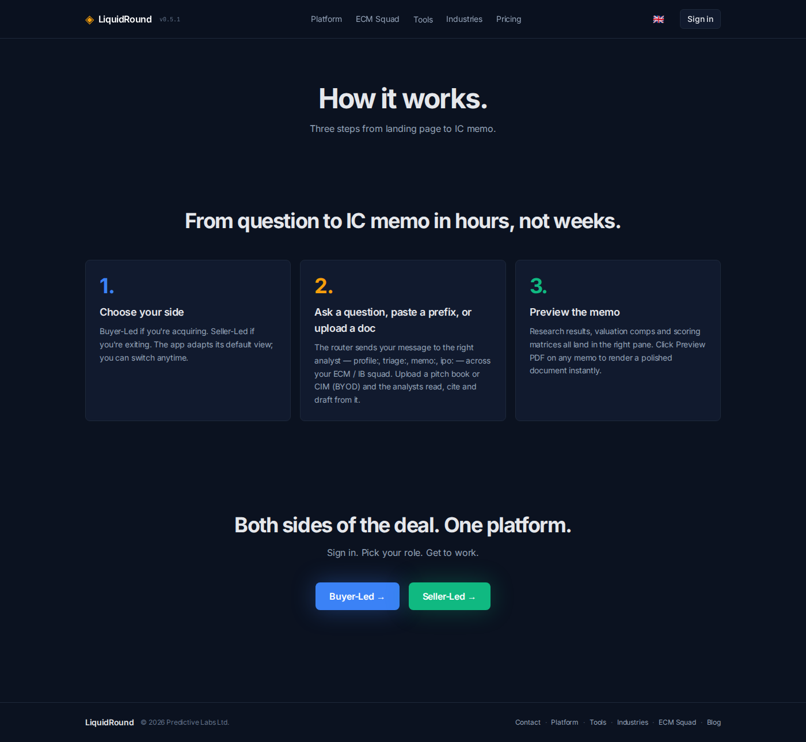

---

## Exports, account, and training

**Exports:** XLSX, DOCX, branded PDF, CSV, press-release Markdown/Word/PDF. **Account:** profile, password, currency (EUR/GBP/USD), role, deal preferences, digest notifications. **Training:** Deal Street scenario-based RPG. **Keyboard:** Enter = send, Shift+Enter = newline.

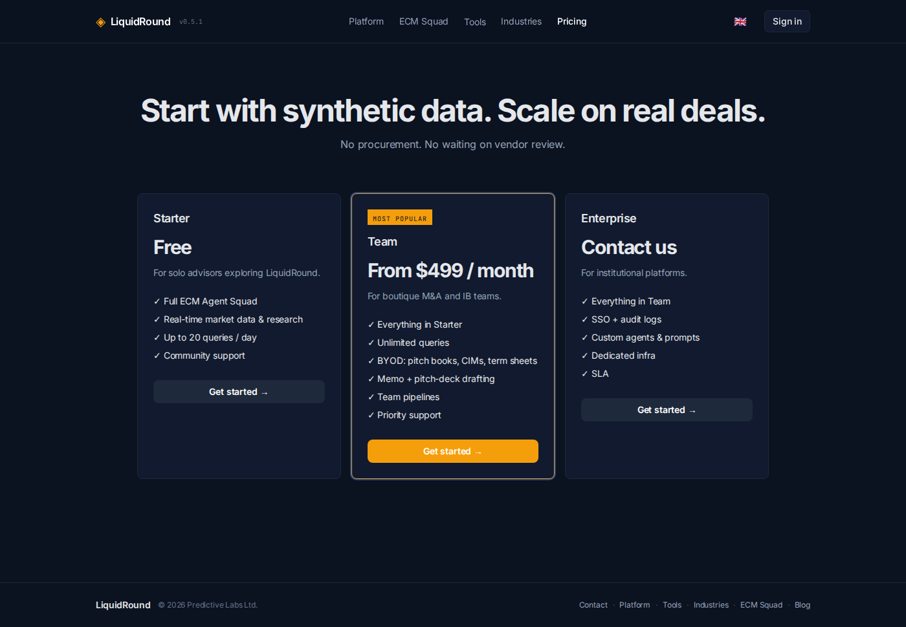

---

## Demo checklist

1. Sign in → show persistence and Data Room.
2. IR Press Release Creator with a real company topic.
3. Review source notes and verification placeholders.
4. Export to Markdown, Word, PDF → save to Data Room.
5. `ir-triage:` on a hypothetical material event.
6. `ir-publish:` → wire-ready package + checklist.
7. Contrast `releases:` vs `write-release:`.
8. Open Skills → Press Release Writer skill.
9. Finish with a public-markets page.

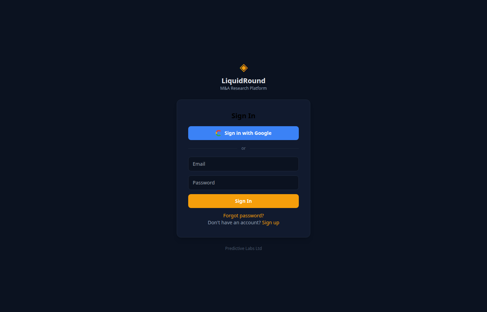

---

## Document control

Generated from platform state on **2026-07-28**. Prior editions archived under `docs/archive/`. The `regenerate-liquidround-demo` skill archives, audits, refreshes, and produces timestamped MD + PDF + PPTX.

LiquidRound v0.7.0 — Predictive Labs Ltd
